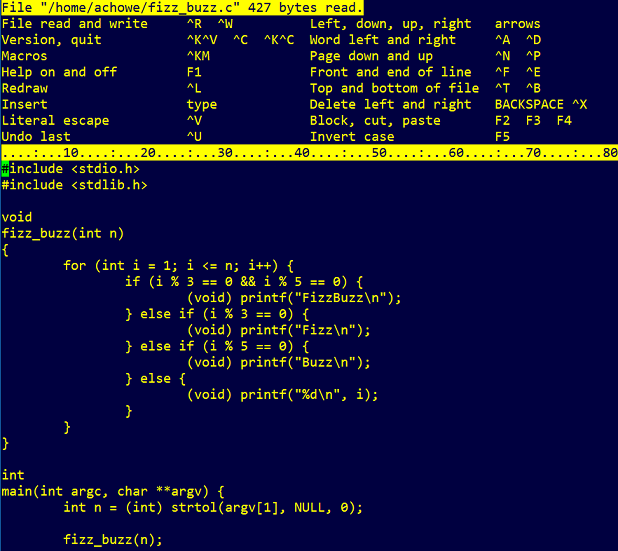

ae - Anthony's Editor
=====================

Anthony's Editor aka `ae` is a Curses based text editor for POSIX systems.  It is an example of the "Buffer Gap" method outlined in the [The Craft Of Text Editing](http://www.finseth.com/craft/) used by many Emacs style editors.

* [Best Utility - IOCCC Winner 1991](91)  
  Original winner with spoiler source code.  
  All IOCCC winners are in the Public Domain.

* [July 1993](93)  
  Last major release with some additional functions; cleaned up for GitHub.  
  Now under BSD-1-Clause license.

History
-------
Written by Anthony Howe, the original `ae` is a full screen vi-style text editor written in less than 1536 bytes of C source code and won the [International Obfuscated C Code Contest](http://ioccc.org) [1991 Best Utility](https://www.ioccc.org/years.html#1991_ant).  It later appeared in Don Libes's book "Obfuscated C And Other Mysteries".

After, `ae` grew with additional commands, like block cut/paste, inline help, macros, and ability to be configured for vi-style (modal) or emacs-style (mode-less) text editing.  It was published as part of a trio of tools in [CUG #388 Anthony's Tools](http://www.hal9k.com/cug/V300E.HTM#cug388) (which included [am](https://github.com/SirWumpus/ioccc-am), [ag](https://github.com/SirWumpus/ioccc-ag)) as reviewed by "The C Users Journal".

`ae`, because of its small binary size, was the base system and rescue disk editor for Debian 1.1 (Buzz) through to Debian 2.2 (Potato).  `ae` was replaced in Debian 3.0 (Woody) by `Nano` (see [Debian 3.0 Package Removals](https://www.debian.org/releases/woody/i386/release-notes/ch-appendix.en.html#s-removed-other)).  Again for its small size, `ae` was also part of the [Linux Router Project](https://www.linuxjournal.com/article/3223).

`ae` has inspired some derivative editors: a Japanese version [Ari](https://github.com/ari-editor/ari), several by Hugh Barney (Femto, [Atto](https://github.com/hughbarney/atto#derivation), [Zepto](https://github.com/hughbarney/zep#derivation)), Terry Loveall's [ue](https://github.com/kisom/editors/tree/master/ue), and [kg](https://github.com/kristofer/kg#Derivation) written in Go.

### Publications

* Don Libes, Obfuscated C and Other Mysteries, Wiley, 1993, pg 369.  
  ISBN 0-471-57805-3.
* Dale Scheetz, The Debian Linux User's Guide, Linux Press, 1997, pg 192.  
  ISBN 0-9659575-0-0.
* The C Users Journal, November 1993, pg 121  
  <http://ftp.math.utah.edu/pub/tex/bib/toc/cccuj.html#11(11):November:1993>

### Rant

I tried to get a version of this history saved on the english Wikipedia, because the [French Wikipedia version](https://fr.wikipedia.org/wiki/Anthony's_Editor) I stumbled on lacked the history.  Wikipedia english rules are so demanding that they just deemed `ae` unworthy, because it wasn't talked about enough.  Middle finger to Wikipedia for any help in perserving smaller parts of tech. history.  (And don't get me started on Wikimedia markup when Markdown is so simple to use.)
